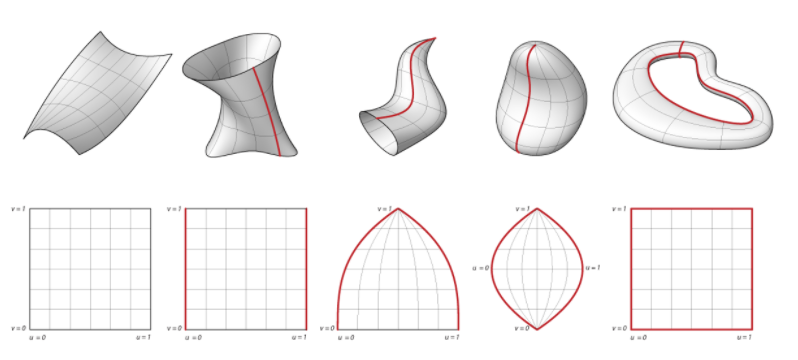
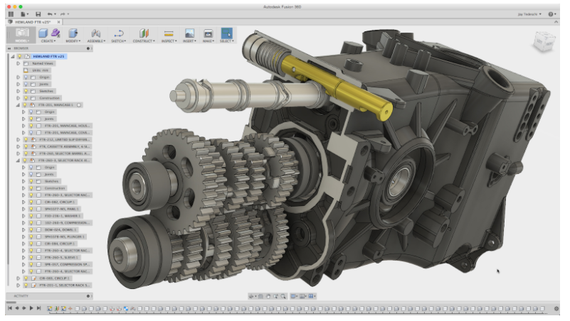
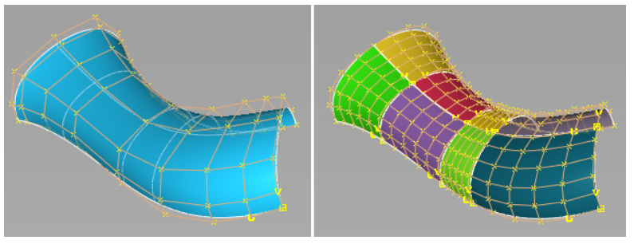
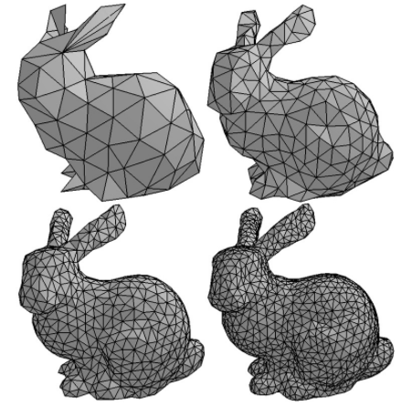

The types of modeling technologies described here were developed for industrial purposes: surface modeling came out of the car manufacturing industry because the model is able to capture information that are critical to manufacturing with thin metal panels. Solid modeling came out of the machining and engineering world. Geometry types and their respective industries remain strongly entwined. Understanding the nuances, properties and characteristics of these geometries will strengthen their utilization for our purposes.

> In this section, you will learn:
* Geometry Types
* Surfaces
* Solids
* Meshes
* Why we use Rhino

## Surface Modeling {#SurfaceM}
>Surfaces alone have zero depth, and subsequently zero mass.

A surface can be defined in a number of ways depending on context, but for you're looking for an analogy, it could be likened to a flexible sheet which has no thickness. Like a single-sided printed sheet, **it has a front facing side and a back**. If you picked a point on that surface, not unlike marking a dot on a piece of paper, you could imagine an imaginary vector that sticks out perpendicular to the surface, toward the front face. This is known as a **surface normal**, for which there are infinite across the surface, all pointing out frontwards.

Surface Modeling anecdotally can be conceived of having no ‘interior’ when cut. Because of this infinity thin surface, it affords a ‘light weight’ or low amount of data within the geometry or modeled artifact. This makes it a favorite among animation, film, video game design as it abstracts real-world geometry and does not accurately reflect real-world physical attributes ultimately affording more flexibility and complexity.

## Solid Modeling

Solid Modeling, conversely, has mass, or depth, to the surface. As such, aside from platonic solids, i.e. a sphere, it has three or more sides that comprise its three-dimensional geometry. Being a close, solid piece of computational geometry the normals, or direction, of any one surface that comprises the geometry, when closed, all have a uniform, outward facing direction.

Solid modeling can be conceived as having an ‘interior’ when cut through or, anecdotally, similar to cutting through a block of wood. This makes it a favorite within the realms of BIM, industrial design, and engineering to name a few due to its ability to representing real-world geometry that accurately mirrors real-world physical attributes. Being inherently data-rich, the ability to analyze and extract information relative to fabrication … watertight

## NURBS Surfaces

>Non-Uniform Rational Basis Spline (NURBS) is a mathematical model commonly used in computer graphics for generating and representing curves and surfaces.

It offers great flexibility and precision for handling both analytic and modeled shapes.

* Precise curvature is easy
* Smooth curvature is easy
* Complex Topologies are difficult
* Shifts in level of surface detail are difficult
* Low number of control points for resolution
* Very flexible

## Polygon Meshes

A Polygon Mesh (Mesh) is a collection of vertices, edges and faces.

With the simplicity of points and a pattern of connection, meshes can define the shape of any polyhedral object in 3D computer graphics and solid modeling **efficiently**. The faces usually consist of triangles (triangle mesh), quadrilaterals (mesh quads), or other simple convex polygons, since this simplifies rendering, but may also be composed of more general concave polygons, or polygons with holes.

* Very lightweight, fast rendering
* Not smooth, more curvature = more facets
* Complex Topologies are easy
* Shifts in level of surface detail are easy
* High number of control points for resolution
* Less flexible

## SubDivision Modeling

>SubDivision is a modeling technique for making clean, high-resolution models, with scalable detail by manipulating a lower-resolution "cage" model and using software to subdivide for a smoother surface.

The smooth surface can be calculated from the coarser piecewise linear polygon mesh as the limit of recursive subdivision of each polygonal face into smaller faces that better approximate the smooth surface. Subdividing increases the number of vertices on the model, making curves more rounded. Usually each subdivision level increases the vertex count 4x the original count.
It is used to some degree in almost all industries that employ digital artists and 3D computer graphics.

* Hybrid of NURBS and Mesh surfaces
* Toggle between polygonal and smooth representations
Complex topologies are easy
* Shifts in level of surface detail are easy
* Low number of control points for resolution
* Less flexible in certain applications

## Modeling Platforms
> Understanding the ecosystem of modeling platforms helps us understand why we use Rhinoceros

Per the entaglement of modeling technologies and their industries, there are a number of platforms in the market that vary technically and cater to the needs of certain industries above others.

| | Nurbs Modeling | Solid Modeling | Mesh Modeling | Subdivision Modeling |
| --- | --- | --- | --- | --- |
| Rhino | x | x | x | x* |
| Maya | x | | x | x |
| 3DS Max | x | | x | |
| Digital Project | x | x | | |
| Solidworks | | x | | |
| Alias Studio | | x | | |
| FormZ | | x | | |
| Sketchup | | | x | |
| Blender | | | x | |
| ZBrush | | | x | |
| TopMod | | | | x |
| Silo | | | | x |
| Modo | | | | x |

<strong>Go rhino!</strong> The focus of this Field Guide will center around Rhino as a software platform utilizing NURBS towards the production of modeling computation geometry from curves to surfaces and solids.

