--
layout: post
title: Introduction
description: Introduction
field-guide: Rhinoceros Digtal Camera Field Guide
order: 3
---

The objective of this guide is to familiarize Rhino users with native camera settings and viewport properties. You will learn how to construct views and save out high resolution screenshots.

---

<strong>Support Our Mission!
</strong> The <a href="http://www.pratt.edu">ITL</a> publishes online for free in our commitment to the design community and passion for education. Support us on <a href="http://www.drip.com">Drip</a>.

---

##01 | Rhino Viewport{#rhinoVp}

When setting up your perspective views in Rhino, you want to think about how the camera is being used to helpfully depict your scene, for whatever purposes. You may wish to focus on circulation and get a close up of the stairs and passages into a space, or you may be interested in a sequence of spatial experiences as you move through a space or series of spaces. Regardless of your focus, a healthy understanding of how to set up your camera shots will be imperative in helping you reveal these various conditions clearly.

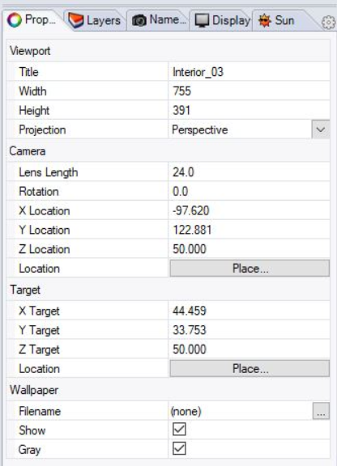

##02 | Constructing Views{#const}

To better understand how and where to take a view from within your Rhino model, we must think of it as a photograph. Looking at a few architectural photography examples by Iwan Baan, we can see how he frames and structures his views for maximum impact.

Architectural Photography

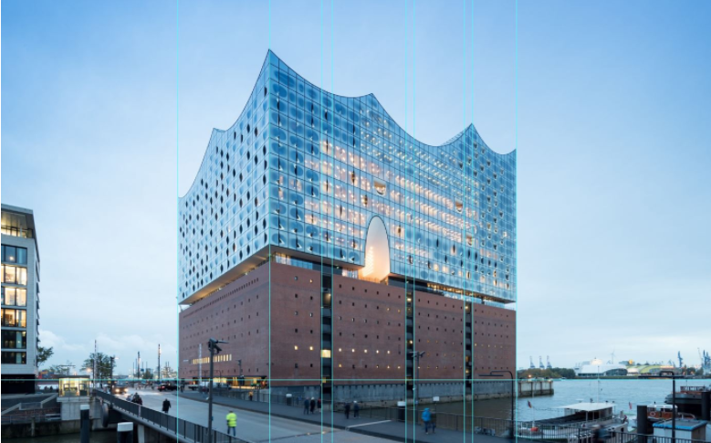

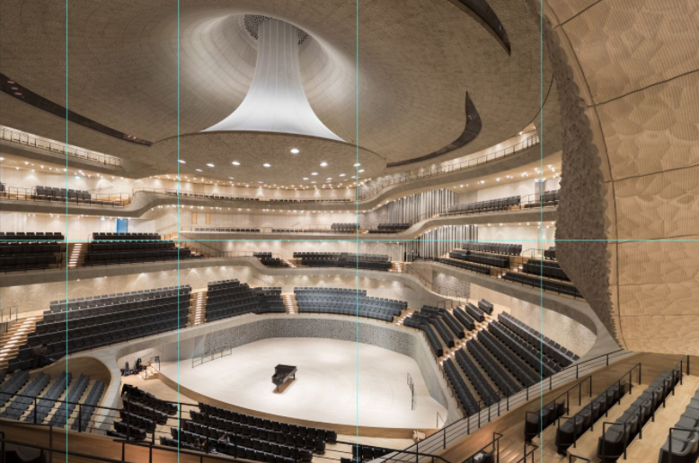

You can see that all of the building’s vertical lines remain vertical and avoid parallax or distortion by looking (unnecessarily) up or down. The idea is to keep the camera straight for a true and honest view of the architecture. The Rhino equivalent would be to set your Camera Z Location = Target Z Location.
Camera Location

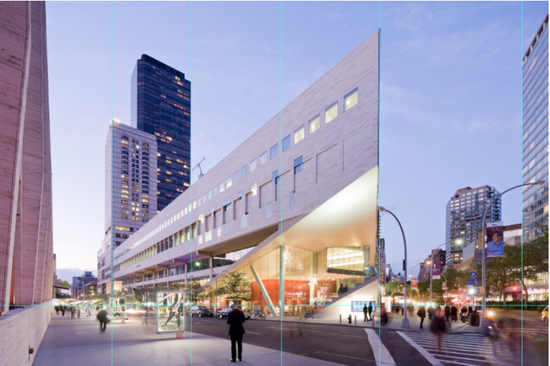

Within Rhino, here are 3 ways you can adjust the camera location.
Panning and Zooming around within the active Viewport
Setting x,y,x coordinates within the Viewport Properties
Using the “Camera” command and moving the camera location and target location

###Viewport Camera Navigation{#camnav}

Mouse/Keyboard Combinations:
Right click- pan (2D view)
Right click- orbit (3D view)
Shift+Right click- pan (3D view)
Ctrl+Right click- zoom (3D view)
Atl+Right click- dolly zoom (3D view)
Mouse Wheel- zoom

###Camera/Target X,Y,Z Location{#camtar}
Camera is the x,y,z position of the viewpoint or eye point.
Target is the x,y,z position in space that is at the center of the viewport and about which the view rotates.
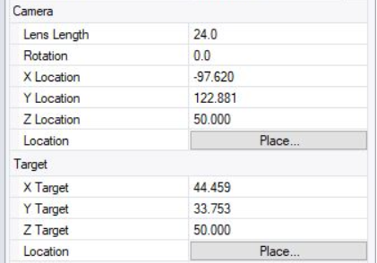

###“Camera” Command{#camcmd}

The Camera command shows, hides, and toggles the visibility of the viewport camera widget. Use the camera widget's control points to move the camera widget, to drag the camera and target points, and to change the lens length of the perspective viewport.

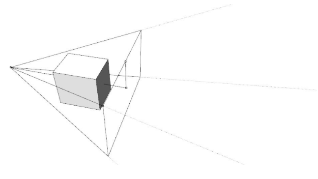

###Lens Length{#lens}

When the projection is set to perspective, you can change the Lens Length of the camera. The Lens Length is equal to the “focal length” of a camera.

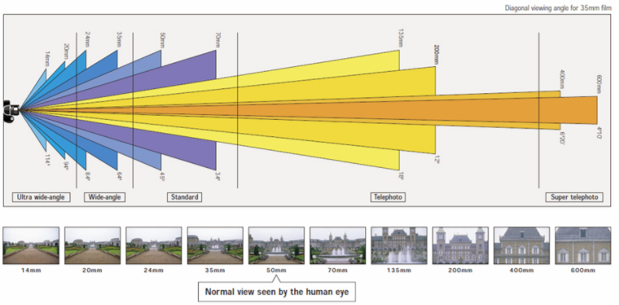

Focal length, usually represented in millimeters (mm), tells us the angle of view—how much of the scene will be captured—and the magnification—how large individual elements will be. The longer the focal length, the narrower the angle of view and the higher the magnification. The shorter the focal length, the wider the angle of view and the lower the magnification.

Lower lens length is good for capturing interiors 18mm-35mm
Higher lens length is good for capturing exteriors 35mm-50mm

>######Interior View - 24mm Lens Length
>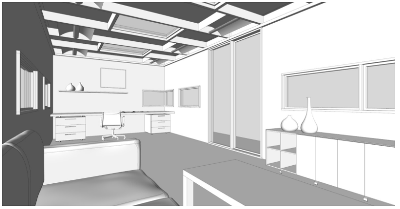

>######Interior View - 35mm Lens Length
>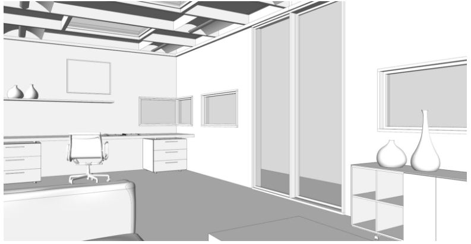

>######Interior View - 50mm Lens Length
>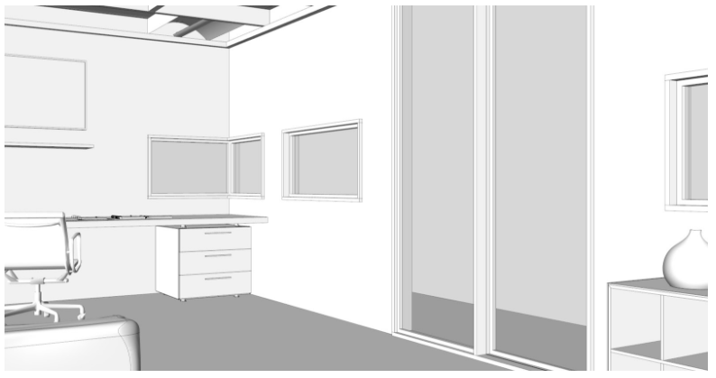

##03 | Saving Views{#saving}

Save your Camera View and access it again. After selecting your camera views, you want to be able to save that view and come back to it again over and over again. The consistency will be critical for making images.

Within Rhino, here are 2 ways you can save your view.
Clicking on the Viewport Tab at top Set View>Named Views
Using the “NamedView” command and accessing all of your views in a Windows

- Clicking on the Viewport Tab at top Set View>Named Views

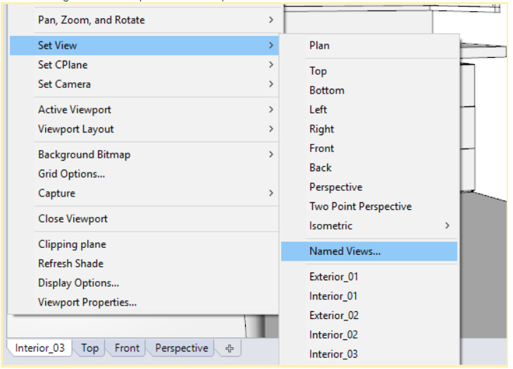

- Using the **NamedView** command and accessing all of your views in a Windows
Manages the named views list to save, restore, and edit named views

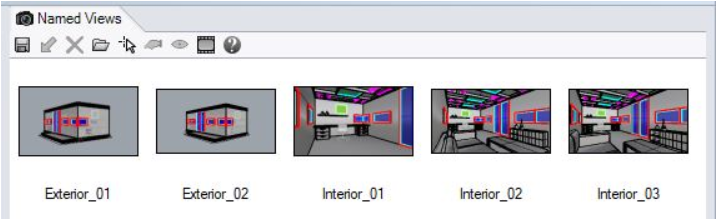


###Saving Screenshots

Save your camera views to an image for representation with high-resolution screen shots.

Use the **-ViewCaptureToFile **command.

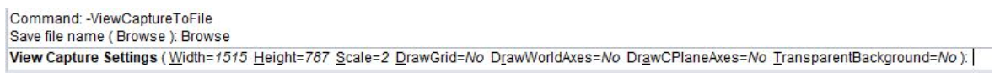

> ViewCaptureToFile saves the contents of the view with a specified width and height, disregarding the current viewport size. Viewport borders, cursor images, and other decorations are not saved.

To set options, at the command line, type -ViewCaptureToFile.
These options stay in effect when the command is subsequently run normally with the exception of the width and height, which are taken from the current viewport size.
- Width: Sets the image width. This option persists when the command is run in scripting mode. When the command is run normally, the width of the current viewport determines the image width.

- Height: Sets the image height. This option persists when the command is run in scripting mode. When the command is run normally, the height of the current viewport determines the image height.

- Scale: Scales the image from the viewport size. For example, with a viewport that is 400x600, a scale of 2 will make the image 800x1200.
DrawGrid: The grid appears in the captured image.

- DrawWorldAxes: The world axis icon appears in the captured image.

- DrawCPlaneAxes: The construction plane axes appear in the captured image.

- TransparentBackground: All background pixels will have a 0.0% alpha value. This overrides the DrawWorldAxes setting.

