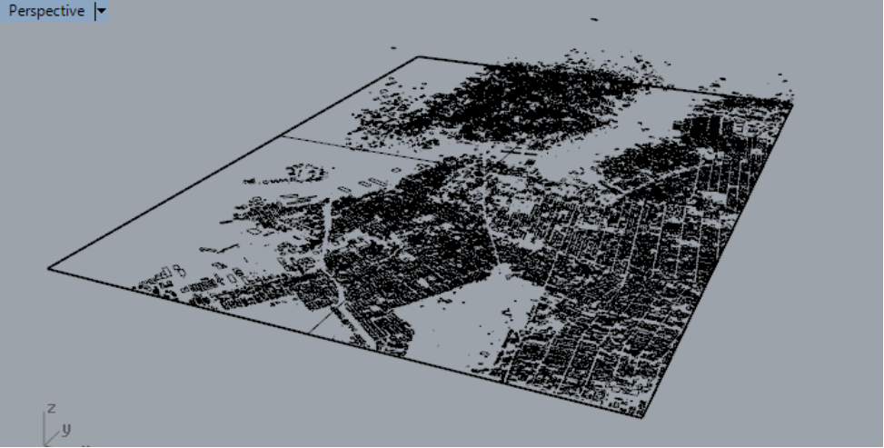

GIS is a system that relates information to locations on earth. A GIS point can at a minimum consist of an identifier (Id) and a location on a coordinate system. For example, a street intersection can be given an Id (It’s name, or an arbitrary number/string) and a coordinate marking its position in space. As you can imagine, there is more to a street intersection than these two things, such as the names of the streets which are intersecting, when it was built, the speed limit at that moment, etc. ad infinitum.

There are a number of interfaces for parsing GIS data. A very common tools for architects to access GIS data is via Grasshopper. However, in this primer, we will focus on the general task of site modeling with more common GIS tools in combination with Rhino 3D. The primer will guide you through the process of finding appropriate terrain and building footprint data and the steps it will take to creating a complete 3D model in Rhino.

## Tool Breakdown

<strong> Have at the ready:</strong>

#####[Rhinoceros 5 ](https://www.rhino3d.com/download/rhino/5/latest)

STUDENT DISCOUNT

#####[QGIS ](https://qgis.org/en/site/)

FREE

- Rhinoceros 5
- A NURBS modeler for the design industry
→ We will be using Rhino’s scripting function to facilitate mesh generation of topography and building mass.

- QGIS
- Includes a large collection of open source GIS toolkits from an active community → A very powerful GIS toolkit we will use to process GIS data.

---

## Finding Data {#}

Most US governmental agencies make GIS data available to the public. The best way to find data is by asking first what kind of data you want. Data can be found at federal, state, or local agencies. By knowing what type of data you need, it will be easier to track down the agency that has the specific dataset you require.

For our example, we will use 3 sets of data, one from USGS’s National Map to find extremely high resolution terrain elevation data call National Elevation Dataset (NED). The one we are looking for has a resolution of 1 image pixel equals to 1 meter x 1 meter in physical dimension. Another dataset we will download from New York City’s Opendata platform, it has all of NYC’s 5 boroughs building footprint with building height information.

For your convenience, you can find all the data with the following links.

- From USGS National Map - NYC 1-meter NED (4 tiles)
- [Example Tile 01](https://prd-tnm.s3.amazonaws.com/StagedProducts/Elevation/1m/IMG/USGS_NED_one_meter_x58y452_NY_CMPG_2013_IMG_2015.zip)
- [Example Tile 02](https://prd-tnm.s3.amazonaws.com/StagedProducts/Elevation/1m/IMG/USGS_NED_one_meter_x59y452_NY_CMPG_2013_IMG_2015.zip)
- [Example Tile 03](https://prd-tnm.s3.amazonaws.com/StagedProducts/Elevation/1m/IMG/USGS_NED_one_meter_x58y451_NY_CMPG_2013_IMG_2015.zip)
-[Example Tile 04](https://prd-tnm.s3.amazonaws.com/StagedProducts/Elevation/1m/IMG/USGS_NED_one_meter_x59y451_NY_CMPG_2013_IMG_2015.zip)

- NYC Building Footprints
- [Shapefile](https://data.cityofnewyork.us/api/geospatial/nqwf-w8eh?method=export&format=Shapefile)

## Processing Data

> The raw dataset we downloaded need to be process before they can become useful. Namely, we need to stitch the image tiles of the NED and NAIP data, make sure the map projection system is compatible with Google Earth, and re-project the building footprint to the same map projection system as the rest of the data.

## QGIS

To process the image and vector data, we will use an open source software call QGIS. GIS software, in general, process data differently from other image processing or vector processing tools. Because GIS files tend to be very big, it very common to be working with files that are over 2Gb. These type of files will easily crash Photoshop, Illustrator or Rhino. GIS software do not read and cache data into RAM, which allows you to work with huge files efficiently, so it is important for you to understand why it’s necessary to learn GIS if you want to work with real life datasets.

Install QGIS and choose **Express Desktop Install**. When installation completes, click on QGIS Desktop under OSGeo4W to open the app.

## Landscape Processing

We will first process the NED data. Since we downloaded the NED data as 4 separate tiles, we will need to combine them into 1 file. As the downloaded NED files are zipped, each file should be unzipped into separate folders. Then, we will need to locate the actual data file and put them in the same folder.

> It may seem redundant at first but once you have tried unzipping the first file, you will find many seemingly random files and it can get messy rather quickly.
In any case, the files we are looking for has the file extension of **.img** and they typically have the largest file size. Cut and paste all the **.img** files into a separate folder so it looks like this.

Once you have the files in the same folder, follow these steps:

In QGIS, click **Raster > Miscellaneous > Merge**

Under **Input Files**, pick the 4 .img files, and under **Output Files**, type in a name for the joined file, and choose **Geotiff **as the file format.

Make sure **Load into canvas when finished** is checked and click **OK**. You should now have the joined NED data in QGIS. Be aware that this image is about 1.5Gb with about 20000px X 20000px.

## Building Footprint Processing

Next we process the Building Footprint data. It should be obvious that every 2D map is a projection of the spherical earth.
> In the world of GIS, every agency that produces geospatial data seem to have a different preference for projection systems, mostly due to the various idiosyncrasies of the map projection systems themselves, some systems maintain true distances but distorts area, some provides true north but completely distorts shapes...etc. The consequence of this fact is that we often times find data with different projection systems and we need to adhere to one and convert all the data we use to that same system, this is particularly critical when we export the data out to other platforms like Rhino 3D. 

First **drag and drop** the file that has **.shp** extension to QGIS’ Layer panel, and you should now have the map of all building footprint in the 5 boroughs appear on the main screen on the right.

You should note that the street grid is not “square” as the map seem “skewed”. That is due to the projection system used. On the lower right corner of the screen, you should see EPSG:4326, that is the projection system currently being used.

To convert the file’s projection system, **right click** on the name of the file in the Layer panel, and **click Save As**, a Save vector layer as… window will pop up. **Choose ESRI Shapefile** for Format, and give the new file a unique name, in this case, **NYC-FP-26918**.

Click the globe icon next to CRS. Under **Filter **type **26918**.

Then click on NAD83/UTM zone 18N EPSG:26918 and click OK.

Click **OK** again to save the layer.

Now with both layers referencing 2 different projection systems, we will need to get rid of the EPSG:4326 file. Right click on the layer name and click Remove.

QGIS will not automatically set the file to the new coordinate system, so we need to do it manually. **Click on the globe icon** on the lower right corner. As done previously, type 26918 in Filter and click on NAD83/UTM zone 18N EPSG:26918, then click **OK **at the bottom.

The map should now be properly projected and the Manhattan street grid should be squared.

## Site Selection & Import

Unless you are operating at urban design or landscape scale, you will most likely want to zoom in and define a more specific site boundary. This part of the workshop will focus on cropping the 2 sets of data to show only the area of interest and more importantly, reduce the file size by eliminating unnecessary elements.

Your QGIS layers should have both the building footprint and NED files loaded, and you Layers Panel should look like this:

Also as a precaution, make sure the projection system says **EPSG:26918** at the lower right corner of the screen. Your main QGIS screen should look something like this:

To crop both the building footprint and NEd, we will need to create a cropping region. To do this, go to _**Layer > Create Layer > New Shapefile Layer. **_

A window will pop up. Check **Polygon** and most importantly, set the **CRS** to **EPSG:26918.** Then click OK, a window will pop up to ask you for a name for the new layer, just type in **TEMP** as this is just a temporary file that will be deleted later.

With the temp layer highlighted, click on the **yellow pencil** to make the layer editable.

Next click **Add feature** to enable drawing.

Back on the main screen, use your middle mouse wheel **(MMW)** to zoom and pan into the area of interest. **Click to draw a boundary** and **right click to end drawing.**
> Be aware that QGIS is not a CAD program and it does not allow you to snap to orthogonal constraints. There are a few free plugins that will let you do this simple task but it’s beyond our scope.
For now, we will use a little work-around to create a squared boundary. However, if you prefer to use a non-rectangular boundary, by all means just draw the shape you want.

Once the shape is drawn, click on the **yellow pencil** again and **Save** the edits. Next click **Vector > Research Tools > Polygon** from layer extent

Use the temporary boundary file as the Input Layer, then click the **…** button to enter a proper file name. Click **RUN** and you should see a perfect rectangle appear. Right click on the **temp layer** and click **REMOVE** to get rid of the temporary file.

We will now use the site boundary to clip the NED file. Go to **Raster > Extraction > Clipper**

In the Clipper popup window, chose **NYC-NED-1m** as the input file, choose a name for the output file, click on **Mask** layer and select the site boundary as the Mask, and check Crop the extent of the target dataset to the extent of the cutline. Click **OK** to finish.

Now to crop the building footprints, go to **Vector > Geoprocessing Tools > Clip**

Choose **NYC-FP-26918** as the Input layer, Extent as the Clip layer, choose a name for the Clipped file, click RUN.

You should now have both files cropped and your screen should look like this:

## Format Conversion

Before we move to Rhino, we need to do one last thing in QGIS, which is to convert the files to something Rhino can read.

We start with converting the building footprint file. With the building footprint layer highlighted, click on the **Open Attribute Table** button to see the database associated with the file.

As you can see, there is a rather large spreadsheet associated with the geometries. One of the columns in the spreadsheet indicates the height of the roof for every building footprint. We will use this information when exporting the file.

To do that we need to prepare the file again. The function we will use is based on a very powerful library call GDAL, we will use it to save the file as DXF format and use the heightroof data to write the z coordinate of each footprint when exporting. However, part of the quirks of GDAL is it will create a hatch pattern if its sees the GIS geometry is a polygon. Since hatch pattern does not contain z-coordinates, we will need to convert the file to lines.

Highlight the cropped building footprint layer and go to **Vector > Geometry Tools > Polygons to lines.**

Make sure **Input layer** is the clipped building footprint, Choose a new file name for Lines from polygons, click **RUN**.

Now is the tricky bit, we will need to run the following function in Command line. **Run the OSGeo4W Shell **

A command prompt will pop up. In the window, type in the word **CD** and make sure **spacebar** is pressed after the word, then go to your File Explorer and find folder where you placed the building footprint file you just created, click on the **folder** icon and drag it to the **OSGeo4W** **Shell window**. This will automatically write the path where you file is located. Press **Enter**.

Now type **ogr2ogr -f DXF nyc_bfp.dxf BFP.shp -zfield heightroof** in the shell, and press **ENTER**.
> Ogr2ogr is a GDAL function that convert between many different file formats. -f DXF tells the function to convert to DXF, nyc_bfp.dxf is the name we want to use for the converted file, BFP.shp is the file name of the GIS file of the building footprint, -zfield heightroof tells the function to use the heightroof data column to write the z-coordinates.

You will get a number of errors stating that DXF does not support field creation, that is normal as DXF is not a format that supports database. You may now **open the dxf file in Rhino** and you should see this.

Next we convert the NED data. Again, the goal is to convert to something that Rhino can use to generate the terrain, so even though the steps might seem obscure but it will make sense later. It will also help to understand a little about the structure of how image data is formatted, we will discuss that more in depth in the workshop. **Click Raster > Conversion > Translate (Convert Format)...**

Make sure the Input Layer is the clipped NED layer. For the output file, choose your preferred name, and choose **Arc/Info ASCII Grid (*.asc *.ASC)** as the format.

Now use **25%** for Outsize to reduce the pixel count and click **OK**.

This should be explained further. Double click on the NED layer and you will open the Layer Properties window. The Columns and Rows indicate the number of pixels that image has, it also implies how dense the terrain model is going to be. Since the NED data we use has a resolution of 1 meter, meaning each pixel is the equivalent of 1 meter x 1 meter in physical space, which is extremely high resolution. Unless you really need this level of resolution, I would suggest you crop your site further so it’s roughly 2000 px X 2000 px.
> This number is based on the amount of memory a modern computer needs to generate the geometry. Anything beyond that will slow down your Rhino performance. This is written as of 2017.

For us, reducing the resolution to 25% means each pixel is about 4 meters and reduce the length to around 1820 pixels.

Lastly before we move to Rhino, we need to export the site boundary to DXF format, right click on the **site boundary layer** and click **Save As**, choose **DXF** as format and a file name. Click **OK**.

## Generating Massing Volumes in Rhino

Open the DXF building footprint file, when import options window pops up, use Meters as units and leave the rest as default

Drag and drop the site-boundary DXF file into the Rhino window and import with the same units. As mentioned before, the DXF export treats closed polygons as hatches, so you need to exploded the site boundary to reveal its geometry. When the 2 files come together, you should see something like this.

You should have 2 Rhino Python scripts given to you at the beginning of the session (Download). 1 file will help us generate mesh volumes from the footprints, and the other will help us generate a mesh terrain from the NED data. You do not need to know any scripting to do this. It’s just like pressing any button in rhino. We will tackle the building footprints first.

**Run Tools > PythonScript > Edit**, this will launch a script editor. Click on the **folder button** to open the script name **ExtrudeBuildingFP2.py**

Once the script is opened, click on the Play button to run the script. This script takes all the building footprint curves and create a mesh object. I did not implement an option to make NURBS objects because polysurfaces are very heavy objects for Rhino to handle in huge quantities. But if you prefer to have NURBS objects, please feel free to let me know.

The script will take a little while to run depending on the performance of your computer. When it is done, you should see something like this.

### Generating The Terrain Model

**Put the building massing in a separate layer** and **hide** it. Now **run the other Python script name TerrainGen01.py.** Upon executing the script, it will ask you to pick a .asc file, go and **locate the .asc file** we just generated. When done, you might be surprised to not seeing any objects. Now turn the building footprint layer back on, select all the building mass and the site boundary, **snap to the upper left corner of the boundary and move them to 0,0,0**

If everything went smoothly, you should have all the objects sitting nicely on top of one another, and it should look something like this.

If your terrain model did not match your site, use the site boundary as reference and scale the terrain model accordingly.

<strong>Nice!
</strong> That was quite a ride!

