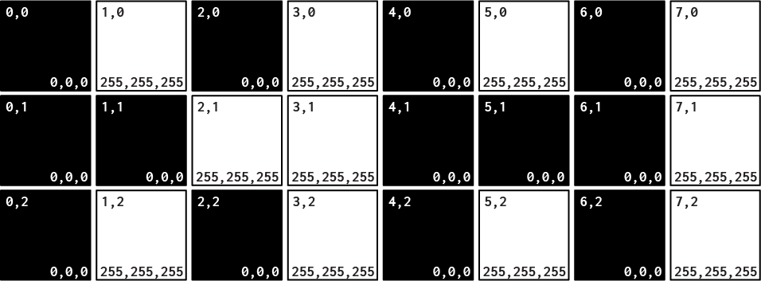
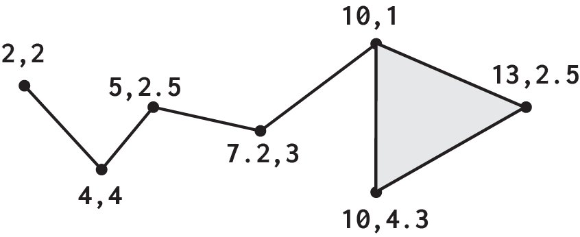

Fundamentally, computer graphics are encoded in two ways: as colored cells (Raster) or geometry (Vector). The image formats we are familiar are rasters which vary in their packaging, either uncompressed or compressed, in order to reduce the file size by leveraging the redundancy in the image's content.

<h2 class="bgChange" data-background="./images/rasterBG.png">Rasters</h2>
 
>Raster graphics are bitmaps, or a grid of individual pixels that collectively compose an image. Raster graphics render images as a collection of countless tiny squares. Each square, or pixel, is coded in a specific hue or shade.

Because raster images are pixel-based, they are subject to image degradation. **Just like photographic images that get blurry and imprecise when blown up, a raster image gets jagged and rough** (See [aliasing](https://en.wikipedia.org/wiki/Aliasing)). This ultimately is because when a raster graphic is created at a certain size, it has a fixed number of pixels that comprise the image. Hence an image attempting to scale an image up by 100 it will become bitmapped. Likewise, scaling an image down, although usually is easier to achieve, does in fact degrade an image as well with detail becoming softer than the original, at its created size.

To maximize the quality of a raster image, you must keep in mind that the **raster format is resolution-specific**. Raster images are defined and displayed at one specific resolution. Resolution in raster graphics is measured in dpi, or dots per inch. The higher the dpi, the better the resolution. Remember also that the resolution you actually observe on any output device is not a function of the file’s own internal specifications, but the output capacity of the device itself. Thus, high resolution images should only be used if your equipment has the capability to display them at high resolution.

**Better resolution, however, is directly correlated to file size.** Just as raster files are significantly larger than comparable vector files, high resolution raster files are significantly larger than low resolution raster files since the computer needs to store information on every single pixel.

<h2 class="bgChange" data-background="./images/vectorBG.png">Vectors</h2>

>Unlike pixel-based raster images, Vector graphics are based on mathematical formulas that define geometric primitives such as polygons, lines, curves, circles and rectangles through translation into points, a start and end, connected by vector paths. 

Because vector graphics are composed of true geometric primitives, they are best used to represent more structured images, like line art graphics with flat, uniform colors. Most created images \(as opposed to natural images\) meet these specifications, including logos, letterhead, and fonts.

Inherently, vector-based graphics are more malleable than raster images — thus, they are much more versatile, flexible and easy to use. The most obvious advantage of vector images over raster graphics is that vector images are quickly and perfectly scalable because they are comprised of dots and vector paths. There is no upper or lower limit for resizing vector images, resulting in no sacrifice of image quality regardless of scale from a note card to a billboard. The edges of each object within the graphic will always stay smooth, crisp and clean. Just as the rules of mathematics apply identically to computations involving two-digit numbers or two-hundred-digit numbers, the formulas that govern the rendering of vector images apply identically to graphics of any size.

Further, unlike raster graphics, vector images are not resolution-dependent. Vector images have no fixed intrinsic resolution, rather they display at the resolution capability of whatever output device \(monitor, printer\) is rendering them. Also, because vector graphics need not memorize the contents of millions of tiny pixels, these files tend to be considerably smaller than their raster counterparts. Overall, vector graphics are more efficient and versatile.

Common vector file formats include AI, EPS, SVG, XML, CGM and PICT \(Mac\).

<h2 class="bgChange" data-background="./images/formats.png">Use Cases</h2>

> File size is important to take into consideration. If a smaller file size is what you’re looking for, stick with vector graphics. 

|  | Vector | Raster |
|-------|--------|---------|
| Schema | Points and Shapes | Pixels |
| Scalability | Native Convert to Raster | Non-Native Convert to Vector |
| Conversion  | SVG, CGM, EPS, XML | BMP, JPG, GIF, PNG,TIFF |

Raster graphics and raster editing are optimal for non-line art images; specifically digitized photographs, scanned artwork or detailed graphics. Non-line art images are best represented in raster form because these typically include subtle chromatic gradations, undefined lines and shapes, and complex composition. Additionally raster graphics are able to portray better color depth. Each pixel can be any one of the 16 million different colors available. 

Overall, as compared to vector graphics, raster graphics are less economical, slower to display and print, less versatile and more unwieldy to work with. Despite its shortcomings, raster format is still the Web and Image standard as, like photographs, they are still best displayed in raster format.

But, if you’re not working with digital photographs, Vector graphics editors would be ideal for all other types of design editing, especially because vector graphics are able to be scaled and manipulated at any size with clarity.

File size is important to take into consideration. If a smaller file size is what you’re looking for, stick with vector graphics. Raster image files can be quite large since the computer needs to remember information about every single pixel.
